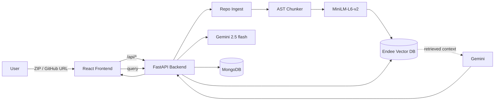

# AI Codebase Assistant — Endee Vector Database

> A production-grade RAG application that ingests GitHub repositories into the **Endee** vector database, then lets developers semantically search, chat with, and audit any codebase in seconds.

Built for the **Endee Labs internship evaluation**. Endee is a first-class, documented, and architecturally central piece — not a swappable detail.

---

## Problem Statement

Developers regularly spend **hours** orienting themselves in unfamiliar codebases — searching for the auth flow, untangling dependencies, finding the right entry point. This application turns that exploration into a one-shot conversation: drop in any public GitHub repo (or .zip), then ask natural-language questions and get answers backed by exact code citations.

---

## Features

| # | Feature | Notes |
|---|---|---|
| 1 | **Repository ingestion** | Public GitHub URL **or** ZIP upload. `node_modules / .git / dist / build / venv / binaries` are auto-ignored. |
| 2 | **AST-aware intelligent chunking** | Python: real `ast` parsing into class / function / method / module units. JS / TS / Java / Go etc.: regex-based class/function detection. **No fixed-size chunking.** |
| 3 | **Embeddings** | `sentence-transformers/all-MiniLM-L6-v2` (384-dim). |
| 4 | **Endee vector database** | Default and primary vector backend. Collections: `code_chunks`, `documentation`, `architecture_notes`. Insert / update / delete / similarity search are all routed through the Endee SDK. |
| 5 | **Semantic code search** | Top-k retrieval with score + file path + language + chunk type. Filterable by `repository_id`. |
| 6 | **RAG chat** | Powered by **Gemini flash 2.5** via `Google`. Multi-turn, session-aware, with inline citations. |
| 7 | **Architecture generator** | Tech-stack detection, folder tree, language breakdown, API routes, dependency graph. |
| 8 | **Code relationship graph** | Module nodes + import edges, rendered as an SVG radial graph. |
| 9 | **Repository health report** | Largest files, most connected modules, possible dead code, circular dependencies. |

---

## System Architecture



**Runtime layers**

- **Frontend** — React 19, React Router 7, Tailwind CSS, Shadcn UI primitives, Lucide icons.
- **Backend** — FastAPI, Motor (async MongoDB), GitPython, sentence-transformers, LangChain text utilities.
- **Vector DB** — Endee (primary) with a FAISS local-dev fallback wrapped behind one `VectorStoreBackend` interface (`backend/services/vectorstore.py`).
- **LLM** — Google Gemini 2.5 Flash via `google-genai` (Free Gemini LLM key).

---

## Endee Integration

Endee is at the heart of the retrieval pipeline. The application:

1. **Connects** to a self-hosted Endee server at `ENDEE_BASE_URL` (default `http://localhost:8080`). The SDK base URL is normalised to `<server>/api/v1` automatically, so you can paste either the origin or the full API URL.
2. **Creates the `code_chunks` index** with HNSW INT8 precision (4× memory savings, near-FP32 recall):
   ```python
   client.create_index(
       name="code_chunks",
       dimension=384,
       space_type="cosine",
       precision=Precision.INT8,
   )
   ```
3. **Upserts code chunks** with the exact metadata schema required by Endee Labs:
   ```python
   index.upsert([{
       "id": "<repo>::<file>::fn::42-87",
       "vector": embedding,         # 384-d MiniLM-L6-v2
       "meta": {
           "file":       "src/auth.py",
           "language":   "python",
           "function":   "verify_token",
           "class":      None,
           "repository": "owner/repo"
       },
       "filter": {
           "language":   "python",
           "repository": "owner/repo"
       }
   }])
   ```
4. **Queries** with `top_k=5` and a metadata filter so retrieval is always scoped:
   ```python
   index.query(vector=q, top_k=5, filter=[{"repository_id": {"$eq": repo_id}}])
   ```
5. **Architecture brief** — the Architecture page calls `services.rag.architecture_summary()` which fires **seven distinct semantic probes** ("entry point", "API routes", "data layer", "auth", "config", "background jobs", "external integrations") against the Endee `code_chunks` index and synthesises a Markdown brief from the retrieved chunks. **No additional file scanning happens for this brief — every excerpt comes from Endee.**
6. **Deletes** by repository when a user removes a repo (per-`repository_id` filter).

**Why Endee** — production-grade HNSW with INT8 quantization, structured metadata filtering, hybrid (dense + sparse) ready, one SDK surface for upsert/query/delete/describe, and explicit support for billions of vectors on a single self-hosted node — well suited to large monorepos.

> **Development fallback** — if Endee is unreachable (e.g. you're running locally without the Endee server started), the app emits a warning and falls back to a file-backed FAISS index that mirrors the same `VectorStoreBackend` interface, so the entire data flow is preserved. Set `VECTOR_STORE_BACKEND=endee` to disable the fallback and fail-fast. See `backend/services/vectorstore.py`.

---

## Installation

### Prerequisites
- Python 3.11+
- Node.js 18+ with Yarn
- MongoDB 6+
- An Endee account & API token — without one the app uses the FAISS fallback.

### Setup
```bash
# Backend
cd backend
pip install -r requirements.txt

# Frontend
cd ../frontend
yarn install
```

### Environment

`backend/.env`
```env
MONGO_URL="mongodb://localhost:27017"
DB_NAME="endee_codebase"
CORS_ORIGINS="*"
GEMINI_LLM_KEY= GEMINI_LLM_KEY...

# Endee (primary, mandatory)
ENDEE_ENABLED=true
ENDEE_BASE_URL=http://localhost:8080
ENDEE_TOKEN=                       # leave blank if your local Endee has auth disabled

# Development fallback (FAISS) — set to `endee` to disable the fallback
VECTOR_STORE_BACKEND=auto

REPO_DATA_DIR=./data/repos
```

`frontend/.env`
```env
REACT_APP_BACKEND_URL=http://localhost:8001
```

## Running Locally

```bash
# Terminal 1 — backend
cd backend && uvicorn server:app --host 0.0.0.0 --port 8001 --reload

# Terminal 2 — frontend
cd frontend && yarn start
```

Open http://localhost:3000.

## Docker

```bash
docker compose up --build
```

`docker-compose.yml` orchestrates MongoDB, the FastAPI backend, and the React frontend.

---

## API Documentation

| Method | Path | Description |
|---|---|---|
| `POST` | `/api/github`             | Clone a public GitHub URL and start indexing. |
| `POST` | `/api/upload`             | Upload a ZIP archive and start indexing. |
| `POST` | `/api/index/{repo_id}`    | Re-index a repository. |
| `GET`  | `/api/repositories`       | List all repositories with status & progress. |
| `GET`  | `/api/repositories/{id}`  | Single repository details. |
| `DELETE` | `/api/repositories/{id}` | Remove repo files + embeddings. |
| `POST` | `/api/search`             | Semantic search over a repo's chunks. |
| `POST` | `/api/chat`               | RAG chat (Gemini Flash 2.5) with citations. |
| `GET`  | `/api/architecture/{id}`  | Tech-stack, folder tree, API routes, dep-graph. |
| `GET`  | `/api/health-report/{id}` | Largest files, dead code, circular dependencies. |
| `GET`  | `/api/vectorstore`        | Vector-DB backend in use + index stats. |

Interactive docs at `/docs` (FastAPI's Swagger UI).

---

## Screenshots

Place screenshots in `/screenshots/` — included placeholders cover the Overview, Upload, Search, Chat, Architecture, and Health Report pages.


## License

MIT
